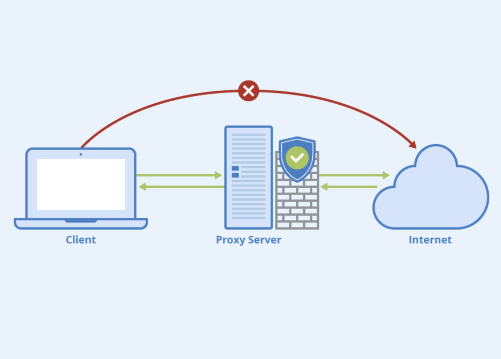
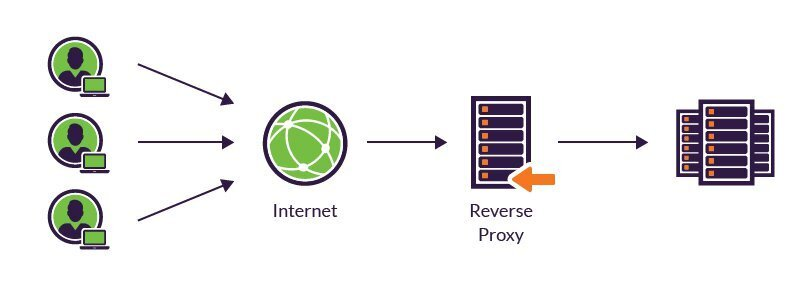

# 목표

프록시(Proxy) 서버의 존재이유, 역할에 대해 이해한다.

# 예상 질문

- 프록시 서버의 기능
- foreward proxy vs reverse proxy
- vpn vs proxy

## Proxy 서버

- **프록시 서버**는 **클라이언트에서 서버로 접속을 할 때** 직접적으로 접속하지 않고 **중간에 대신 전달해주는 서버**를 의미한다.

1. 클라이언트에서 프록시 서버로 전달할 요청을 보낸다.
2. 프록시 서버는 클라이언트로부터 전달 받은 요청을 서버에 요청한다.
3. 서버는 요청에 맞게 데이터를 프록시 서버로 전달한다.
4. 프록시 서버는 서버로부터 전달 받은 데이터를 클라이언트에 전달한다.

프록시 서버는 이런 식으로 특정 요청을 차단하거나 필터링이 가능하다.

## 프록시 서버의 사용 목적

### 보안

프록시 서버가 중간에 경유하게 되면, IP를 숨기는 것이 가능하기 때문에 많이 사용된다.

예를 들어, 쇼핑몰에서 프록시 서버를 이용하여 물건을 구매할 때 생각하면 편하다.

1. 민섭이는 정장을 주문한다.
2. 프록시는 이 요청을 받아 쇼핑몰에 주문을 한다.
3. 물건을 받아, 민섭이 집에 전달해준다.

이 과정에서 중요한 점은, 쇼핑몰은 **민섭이의 정보를 직접 받지 않는다는 것**이다.

민섭이의 요청은 **프록시 서버를 통과할 때 암호화**된다.

암호화된 요청은 다른 서버를 통과할 때 필요한 최소한의 정보만 갖게 되는데, 이는 **민섭이의 ip 를 (보안을 위해) 감춰주는 보안 효과**를 내준다.

따라서 본 서버에서 IP 주소를 역추적해도 포워드 프록시 서버를 사용하면 정체를 파악하기 어렵게 된다.

왜냐면 IP 추적해도 포워드 프록시 서버 IP만 보이기 때문이다.

### 캐싱

어떤 회사에서 프록시 서버를 사용한다고 가정해보자.

A직원이 웹페이지를 검색하면 프록시 서버는 해당 **페이지 서버의 정보를 캐싱**(임시보관)해둔다.

다시 A직원이 해당 페이지에 접근하거나, B직원이 해당 페이지를 요청할 때, 캐시된 정보(페이지)를 그대로 반환할 수 있고, 이는 **서버의 부하를 줄이는 효과**도 낼 수 있다.

네이버에 접근할 때, 원래 각각의 인터넷을 경유해서 네이버 페이지를 받겠지만, 프록시를 이용하면 **프록시내 캐싱 된 네이버 페이지를 불러오기 때문에 훨씬 빠르게 조회**할 수 있는 원리이다.

## 프록시의 두 종류

프록시 서버는 네트워크 상 어디에 위치하느냐, 어느 방향으로 데이터를 제공하느냐에 따라 Forward Proxy와 reverse Proxy로 나뉘게 된다.

### 포워드 프록시 (Forward Proxy)

> **지금까지 설명했던 프록시 서버는, 포워드 프록시 서버를 의미한다.**

포워드 프록시는 클라이언트의 측면에 더 가깝게 위치하며, 클라이언트의 요청을 외부 서버로 전달한다.

### 리버스 프록시 (Reverse Proxy)

> **클라이언트는 직접 서버에 요청하는게 아니라 프록시를 통해 요청을 보내고, 프록시가 이 요청을 실제 서버로 전달한 후 결과를 클라이언트에게 전달한다.**

## 리버스 프록시의 필요성

### 로드 밸런싱 (load balancing)

유명한 웹 사이트는 하루에도 수백만명이 방문한다. 그러한 **대량의 트래픽을 싱글 서버로 감당해 내기엔 어렵다**. 그러나, **리버스 프록시 서버 여러개**를 서버 앞에 두면 특정 서버가 과부화 되지 않게 **로드 밸런싱이 가능**하다.

> 로드밸런싱 : 애플리케이션을 지원하는 리소스 풀 전체에 네트워크 트래픽을 균등하게 배포하는 방법

### 서버 보안

포워드 프록시는 클라이언트의 IP를 감춰준다고 설명했다.

반대로 리버스 프록시는 **본래 서버의 IP주소를 노출시키지 않을 수 있다**.

클라이언트는 인터넷을 통해 **리버스 프록시 서버 url에 요청**을 한다. 그리고 리버스 프록시는 **본 서버에 요청을 경유**해서 보내게 되는데, 클라이언트는 본 서버의 url을 모른채 **리버스 프록시 url을 통해 서비스를 이용**하게 되고, 이는 **본 서버의 정보를 숨기는 효과**를 얻는다.

### 캐싱

포워드 프록시의 캐싱과 비슷한 기능을 한다.

## 포워드 프록시 vs 리버스 프록시 차이점

### 프록시 서버 위치

포워드 프록시 서버는 **클라이언트 앞**에 놓여져있지만,

리버스 프록시 서버는 **웹서버 / WAS 앞**에 놓여 있다는 차이점이 있다.

### 감춰지는 대상

포워드는 직접 서버 url로 요청을 보내지만,

리버스는 프록시 서버 url로만 접근이 가능하다.

따라서, **리버스 프록시는 본 서버의 IP 정보를 숨길 수 있는 효과**를 얻는다.

**Forward Proxy**는 내부망에서 인터넷 상에 있는 서버에 요청할때 먼저 포워드 프록시 서버를 호출하고 프록시가 서버에게 요청을 보내게 되는데, 이로서 서버에게 클라이언트가 누구인지 감출수 있다.

즉, 서버 입장에서 응답받은 IP는 포워드 Forward Proxy의 IP이기 때문에 클라이언트가 누군지 알 수 없다.

## ??? : VPN과의 차이점이 궁금합니다

프록시 서버와 달리 **VPN은, 트래픽 자체를 암호화한다.**

또한, **VPN은 운영 체제 수준에서 동작해 모든 트래픽을 라우팅**한다. 반면 프록시 서버는, 응용프로그램 수준에서 동작해 특정 앱 또는 브라우저의 트래픽만 라우팅할 수 있다.

[https://fomaios.tistory.com/entry/Network-프록시-서버란-feat-필요한-이유-What-is-a-Proxy-server](https://fomaios.tistory.com/entry/Network-%ED%94%84%EB%A1%9D%EC%8B%9C-%EC%84%9C%EB%B2%84%EB%9E%80-feat-%ED%95%84%EC%9A%94%ED%95%9C-%EC%9D%B4%EC%9C%A0-What-is-a-Proxy-server)

[https://inpa.tistory.com/entry/NETWORK-📡-Reverse-Proxy-Forward-Proxy-정의-차이-정리](https://inpa.tistory.com/entry/NETWORK-%F0%9F%93%A1-Reverse-Proxy-Forward-Proxy-%EC%A0%95%EC%9D%98-%EC%B0%A8%EC%9D%B4-%EC%A0%95%EB%A6%AC)

vpn vs proxy

https://aws.amazon.com/ko/compare/the-difference-between-proxy-and-vpn/
