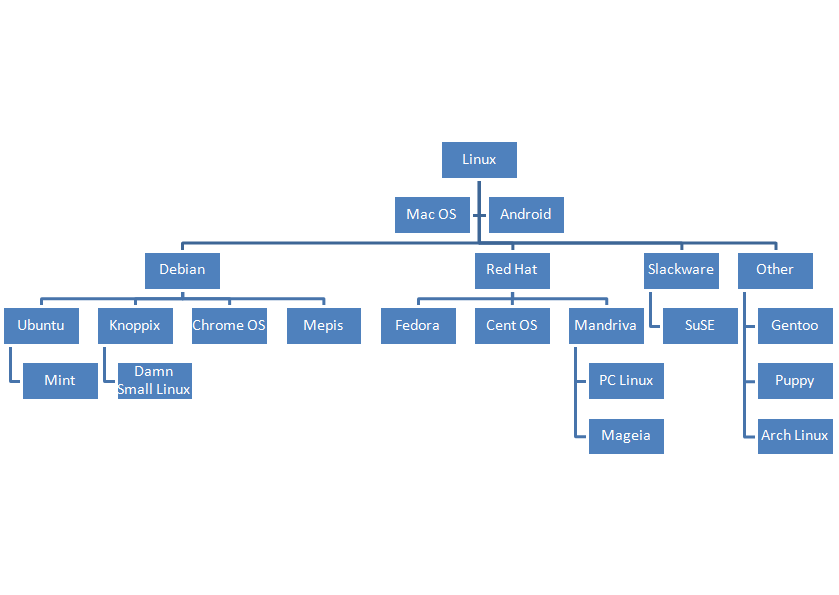

# 운영체제와 컴퓨터

## 운영체제란?

> 운영체제(OS)란 컴퓨터 하드웨어 바로 위에 설치되어 사용자 및 모든 소프트웨어와 하드웨어를 연결하고 하드웨어를 효율적으로 사용할 수 있게 관리하는 소프트웨어 계층이다.
> 좁은 의미 : 커널은 운영체제의 핵심 부분으로 메모리에 상주하는 부분이다.
> 넓은 의미 : 커널 뿐 아니라 각종 주변 시스탬 유틸리티를 포함하는 개념이다.
> EX) Windows, Linux, UNIX, MS-DOS 등

## 운영체제의 목적

- 사용자가 프로그램 실행을 더 쉽게 사용하기 위해
- 컴퓨터 시스템을 더 편리하게 사용할 수 있도록
- 하드웨어를 보다 효율적인 방식으로 사용하도록

## 운영체제의 역할

- **CPU스케줄링과 프로세스 관리**
  - CPU소유권을 어떤 프로세스에 할당할지, 프로세스의 생성과 삭제, 자원 할당 및 반환을 관리
  - FIFO, SJF(Shortes Job First), Round Robin Schedueling, priority shedueling 등
- **메모리 관리**
  - 한정된 메모리를 어떤 프로세스에서 얼만큼 할당해야하는지 관리
- **디스크 파일 관리**
  - 디스크 파일을 어떠한 방법으로 보관할지 관리 (파일 생성, 수정 제거, 공유, 백업, 복구, 주기억장치와 보조기억장치간의 파일 전송 등)
- **I/O 디바이스 관리**
  - I/O디바이스와 컴퓨터 간에 데이터를 주고 받는 것을 관리

## 운영체제 구조

### 커널

- 프로세스 관리, 메모리 관리, 저장장치 관리와 같은 운영체제의 핵심적인 기능을 모아 놓은 것.
- 운영체제의 성능은 커널이 좌우한다.
- 운영체제 : 커널 = 자동차 : 엔진

### 드라이버

- 커널과 하드웨어의 인터페이스
- 하드웨어는 커널과 직접 연결되기도 하고, 하드웨어 제작자가 제공하는 드라이버를 통해 연결되기도 한다.

### 시스템 호출(system call)

- 커널이 자신을 보호하기 위해 만든 인터페이스
- 커널이 제공하는 시스템 자원의 사용과 연관된 함수
- 사용자나 응용프로그램이 자원을 이용하기 위해서는 시스템 호출이라는 인터페이스를 이용하여 접근해야한다. ( :zap: 그 외의 방법으로는 접근할 수 없다. :zap: )
  

> **사용자&응용프로그램 -> GUI -> system call -> 커널 -> 하드웨어 자원 접근**

## 컴퓨터의 요소

> CPU, DMA, 컨트롤러, 메모리, 타이머, 디바이스 컨트롤러 등으로 이루어져 있음.

### CPU(Central Processing Unit)

- 산술논리연상장치, 제어장치, 레지스터로 구성되어 있는 장치
- 인터럽트에 의해 단순히 메모리에 존재하는 명령어를 해석해서 실시

:pushpin: **제어장치(CU : Control Unit)**

- 프로세스 조작을 지시하는 CPU의 한 부품
- 입출력장치 간 통신을 제어하고 명령어들을 읽고 해석하며 데이터를 처리하기 위한 순서 결정

:pushpin: **레지스터**

- CPU안에 있는 임시기억장치
- CPU와 직접 연결되어 있어 연산 속도가 메모리보다 수십~수백배까지 빠름
- CPU는 자체적으로 데이터를 저장할 방법이 없기 때문에 레지스터를 거쳐 데이터를 전달
- SSD/HDD -> RAM -> cache -> register

:pushpin: **산술논리연산장치(ALU : Arithmetic Logic Unit)**

## 인터럽트(Interupt)

> 어떤 신호가 들어왔을 때 CPU를 잠깐 정지시키는 것을 말함.
> 키보드, 마우스 등 IO디바이스로 인한 인터럽트, 0으로 숫자를 나누는 산술 연산에서의 인터럽트, 프로세스 오류 등으로 발생
> 인터럽트가 발생되면 인터럽트 핸들러 함수가 모여 있는 인터럽트 백터로 가서 인터업트 핸들러 함수 발행 -> 우선 순위에 따라 실행

**인터럽트 과정**

1. 기존의 작업을 처리하던 도중, 인터럽트 발생
2. 현재 컴퓨터가 처리하는 일을 중지하고 현재의 컴퓨터 상태를 저장
3. 해당 인터럽트를 처리해주기 위한 인터럽트 서비스 루틴 처리

## Linux와 Ubuntu

`Linux`는 리눅스 커널 및 **UNIX 기반**의 무료 오픈 소스 운영 체제  
`우분투`는 Linux 배포판
