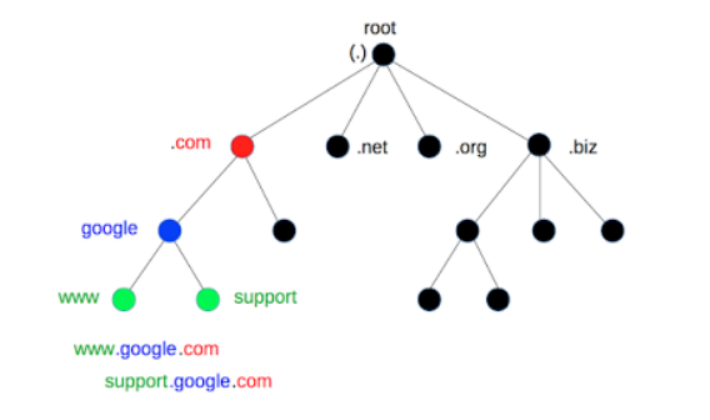
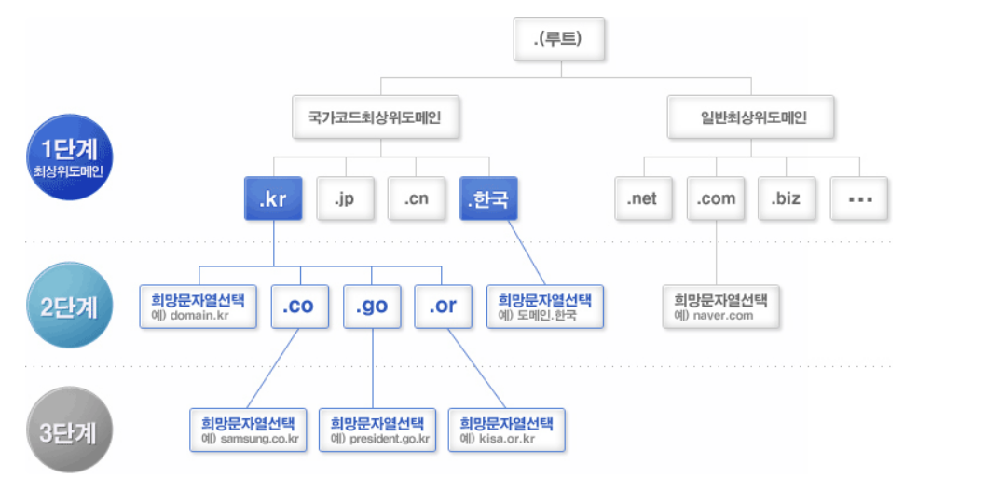
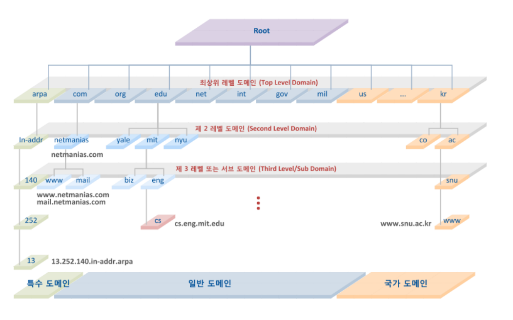

# 목표

DNS에 대해서 이해해보자.

# 예상 질문

주소창에 URL을 입력 시 일어나는 일에 대해서 자세히 설명해주세요

1. **DNS 조회**: 주소("google.com")를 IP 주소로 변환하기 위해 DNS 서버에 조회 요청.
2. **TCP 연결 설정**: 서버의 IP 주소로 TCP 연결을 시작.
3. **HTTP 요청 보내기**: TCP 연결을 통해 웹 서버에 HTTP 요청을 전송.
4. **서버 처리 및 응답**: 서버가 요청을 처리하고 HTTP 응답을 반환.
5. **콘텐츠 렌더링**: 브라우저가 서버로부터 받은 데이터를 처리하여 화면에 표시.

DNS에 대해 설명해주세요

**정의와 기본 기능의 설명**

DNS(Domain Name System)는 인터넷에서 도메인 이름을 숫자로 된 IP 주소로 변환하거나, 그 반대의 역할을 수행하는 시스템입니다.

이는 사람들이 기억하기 쉬운 도메인 이름을 사용하여 인터넷 자원에 접근할 수 있게 해줍니다.

**작동 방식에 대한 설명**

사용자가 웹 브라우저에 URL을 입력하면,

1. 브라우저는 먼저 로컬 DNS 캐시를 확인하여 해당 도메인의 IP 주소를 찾습니다.
2. 캐시에 없으면, ISP의 DNS 서버에 요청을 보냅니다.
3. 이 서버가 도메인의 IP 주소를 알고 있으면 바로 응답하고, 그렇지 않으면 다른 DNS 서버로 요청을 전달하여 필요한 정보를 찾습니다.

참고) ISP는 kt, sk, lg같은 통신사 회사를 포함해 인터넷 접속 서비스를 제공하는 모든 기관이나 회사를 의미합니다.

## 주소창에 google.com을 입력하고 엔터를 누를 때, 네트워크 관점의 흐름

1. **DNS 조회**: 주소("google.com")를 IP 주소로 변환하기 위해 DNS 서버에 조회 요청.
2. **TCP 연결 설정**: 서버의 IP 주소로 TCP 연결을 시작.
3. **HTTP 요청 보내기**: TCP 연결을 통해 웹 서버에 HTTP 요청을 전송.
4. **서버 처리 및 응답**: 서버가 요청을 처리하고 HTTP 응답을 반환.
5. **콘텐츠 렌더링**: 브라우저가 서버로부터 받은 데이터를 처리하여 화면에 표시.

이 전체적인 플로우는 이전에 진행했으니, 가볍게 한번 읽고 넘어가겠습니다.

### DNS 조회

- 사용자가 "google.com"을 입력하면, 브라우저는 해당 도메인 이름에 해당하는 IP 주소를 찾기 위해 DNS(Domain Name System) 조회를 수행합니다.
- 먼저, 로컬 DNS 캐시를 확인하고, 없으면 ISP의 DNS 서버에 요청합니다.
- DNS 서버는 도메인 이름을 IP 주소로 변환하여 브라우저에게 반환합니다.

### TCP 연결 설정

- IP 주소를 얻은 후, 브라우저는 해당 서버와의 TCP(Transmission Control Protocol) 연결을 시작합니다.
- 이 과정에서는 TCP 3-way handshake(동기화와 응답 과정)가 이루어집니다.

### HTTP 요청 보내기

- TCP로 연결이 되었다면, 데이터를 전송하면 됩니다.
- 첫 웹페이지 요청을 위해 GET request를 서버에 보내게 됩니다.

### 서버 처리 및 응답

- 그 요청에 대한 응답을 생성하여 브라우저에 전달합니다.

### 콘텐츠 렌더링

- 브라우저는 서버로부터 받은 데이터를 해석하고 파싱하여 사용자에게 웹 페이지로 보여줍니다.

## \***\*DNS (Domain Name System) 란?\*\***

DNS(Domain Name System)는 인터넷에서 도메인 이름을 숫자로 된 IP 주소로 변환하거나, 그 반대의 역할을 수행하는 시스템입니다.

DNS의 가장 큰 목적은, 사람들에게 편리함을 주기 위해서입니다.

cmd에서 google의 DN을 적어 ping을 확인해봅시다.

google의 IP주소는 142.250.199.110인걸 확인할 수 있습니다.

- 도메인 : www.google.com
- IP : 142.250.199.110

원래는 IP주소를 브라우저에게 제공하면, 해당 서버에서 홈페이지를 제공하는 식으로 동작합니다.

그러나, 저 숫자 덩어리를 보세요. 외우기 힘드니, 마치 별명을 지어서 전화번호부에 정리하고 접근하기 쉽게 하는 시스템이 DNS입니다.

## DNS 동작 순서

큰 그림으로 설명을 먼저 하겠습니다.

사용자가 웹 브라우저에 URL을 입력하면,

1. 브라우저는 먼저 로컬 DNS 캐시를 확인하여 해당 도메인의 IP 주소를 찾습니다.
2. 캐시에 없으면, 인터넷 서비스 제공자(ISP)의 DNS 서버에 요청을 보냅니다.
3. 이 서버가 도메인의 IP 주소를 알고 있으면 바로 응답하고, 그렇지 않으면 다른 DNS 서버로 요청을 전달하여 필요한 정보를 찾습니다.

디테일하게 설명하겠습니다.

한줄요약 : www.naver.com을 입력했을때, 저장된 www.naver.com의 IP주소를 찾을 때 까지 depth를 타고 내려간다.

참고로, 1-8, 2-3, 4-5, 6-7 단계가 페어에요

시작하겠습니다.

### 1단계

- 웹 브라우저에 www.naver.com을 입력하면, 먼저 PC에 저장된 **Local DNS(기지국 DNS 서버)**에게 “www.naver.com”이라는 hostname에 대한 IP 주소를 요청합니다.
  - Local DNS란, 인터넷을 사용하기 위해 IP를 할당해주는 통신사(KT, SK …)에 등록하게 됩니다.
  - 랜선을 통해 인터넷이 연결되면, 가입했던 각 통신사의 기지국 DNS서버가 등록됩니다.
- Local DNS에는, www.naver.com의 IP주소가 있을수도 없을수도 있습니다.
  - 설명을 위해, 모든 과정에서 없다는 전제로 진행하겠습니다.
- 만일 네이버에 접속했던 전적이 있다면, Local DNS에 접속정보가 캐싱되어있어 바로 PC에 IP주소를 제공하고 끝납니다. (1번 → 8번)

### 2단계

- Local DNS는 이제 네이버 IP 주소를 찾아내기 위해 다른 DNS 서버들과 통신을 시작합니다.
- 먼저, **Root DNS 서버**에게 네이버 IP 주소를 요청합니다.
  - 아래에서 사진과 함께 설명할테니, “루트”의 느낌을 가져오시길 바랍니다.

### 3단계

- Root DNS 서버는 요청 IP주소를 찾을 수 없다. 다른 DNS서버에 물어보라는 응답을 합니다.

### 4단계

- Local DNS 서버는 **com 도메인을 관리하는 TLD DNS 서버 (최상위 도메인 서버)**에 다시 네이버 IP 주소를 요청합니다.
  - TLD (Top - Level Domain, 최상위 도메인)
  - 이것도 아래에서 설명할 예정이니, “com 관리”, “최상위 도메인 서버”의 키워드를 기억하시길 바랍니다.

### 5단계

- TLD DNS 서버는 또 요청 IP 주소를 찾을 수 없으니, 다른 DNS서버에 연락하라는 응답을 합니다.

### 6단계

- 이제 마지막입니다.. Local DNS서버는 **naver.com DNS 서버(Authoritative DNS 서버)**에게 다시 네이버의 IP 주소를 요청합니다.
  - Authoritative DNS Server란, 실제 개인 도메인 IP 주소의 관계가 기록, 저장, 변경되는 서버입니다.
  - 그래서 권한의 의미인 Authoritative가 붙습니다.

### 7단계

- naver.com DNS 서버에는 네이버의 IP 주소가 있습니다.
- 그래서 Local DNS 서버에게 www.naver.com에 대한 IP 주소는 222.122.195.6이라는 응답을 합니다.

### 8단계

- 이를 수신한 Local DNS는, 네이버의 IP주소를 캐싱하고 PC에 전달해줍니다.

## Root DNS 서버

맨 처음에, Local DNS에게 네이버 IP 주소가 있는지 물어봤었습니다.

이후에, Root DNS서버에 물어봤죠,

Root DNS는 최상위 DNS 서버로 해당 DNS부터 시작해서 아래 딸린 node DNS 서버에게 차례차례 물어보게 되는 구조로 짜여져 있습니다.

즉, 모든 node DNS 서버들은 이 Root DNS 서버의 주소를 기본적으로 가지고 있다는 말입니다.

그래서, 모르는 DN이 온다면, 가장 먼저 Root DNS에게 물어보는 것.

하지만 Root DNS 서버가 해당 DN의 IP 주소를 모른다면, 그 다음 DNS 서버로 리턴해주는데 그게 바로 TLD (최상위 도메인) 서버입니다.

Root DNS Server : “난 www.naver.com 주소가 없어. 대신 .com를 관리하는 TLD 주소는 알고 있으니, com TLD DNS주소한테 가서 물어봐바”

## TLD 서버 (Top-Level Domaion, 최상위 도메인 서버)

위에서 보았듯, 인터넷 도메인의 체계에서 최상위는 Root로써 인터넷 도메인의 시작점입니다.

그리고 Root 바로 아래단계가, **1단계 도메인**이라고 하며 이를 **TLD(최상위 도메인)**이라고 합니다.

??? : www.naver.com IP주소 주세요

TLD서버 : 네 Authoritative DNS 서버 주소 드릴게요 글로가세요

> 이 도메인을 운영 주체에 따라 일반 최상위도메인, 신규 일반 최상위 도메인 … 등등 다양한 종류의 TLD가 있으나, 너무 깊게 들어가는 것 같아 아래 링크를 첨부하고 더 깊게는 안할게용

https://customer.gabia.com/manual/domain/262/292

## Second-level DNS 서버 (2차 도메인)

Root DNS에서 return해준 TLD 서버주소를 통해 얻은 Second-level dns 서버주소를 return해준 주소를 들고 second-level dns 도메인까지 왔다..

근데 그렇게 요청받은 Second DNS서버는 자체적으로 sub 도메인 서버로 또 넘어가게 됩니다.

## Sub DNS 서버 (최하위 서버)

여기는 www. dev. mail. cafe. 등 구분하는 최하위 서버를 말합니다.

참고로, 여기에선 local DNS를 거쳐가지 않습니다. 애초에 서브도메인은 2차 도메인 내부에 속해있기 때문에..

## 최종 구조

www.naver.com 의 IP주소를 얻기 위해, Root와의 응답, tld와의 응답, 2레벨 도메인의 응답 (서브포함)을 통해 IP주소를 얻게되었습니다..!!

사실 아무 생각없이 사용하던 도메인 url은, 위 사진과 같이 이루어져있던 것이죠..

## 캐시

??? : 아 네이버 IP 다 받아왔다 휴 ㅋㅋ 이제 홈페이지 들어왔네

근데 다른거 검색할라고 탭하나 더 켜서 네이버 방문하려고 하는데, 또 위와 같은 과정을 반복하면,, 너무 비효율적이겠죠

따라서, PC에는 DNS Cache를 활용해 캐시 안에 자주쓰는 DN 주소를 저장해 놓습니다.

이처럼 캐시 정보가 많이 나옵니다.

추가) TTL은 말 그대로 DNS 서버나 사용자 PC의 캐쉬(메모리)에 3600초를 시작으로, 0이되면 메모리에서 사라집니다. 전 469초 남았네요

# 결론

면접장에서 아래 질문이 나온다면, 꼭 대답하시길 바랍니다.

- 주소창에 URL을 입력 시 일어나는 일에 대해서 자세히 설명해주세요

  1. **DNS 조회**: 주소("google.com")를 IP 주소로 변환하기 위해 DNS 서버에 조회 요청.
  2. **TCP 연결 설정**: 서버의 IP 주소로 TCP 연결을 시작.
  3. **HTTP 요청 보내기**: TCP 연결을 통해 웹 서버에 HTTP 요청을 전송.
  4. **서버 처리 및 응답**: 서버가 요청을 처리하고 HTTP 응답을 반환.
  5. **콘텐츠 렌더링**: 브라우저가 서버로부터 받은 데이터를 처리하여 화면에 표시.

- DNS에 대해 설명해주세요
  **정의와 기본 기능의 설명**
  DNS(Domain Name System)는 인터넷에서 도메인 이름을 숫자로 된 IP 주소로 변환하거나, 그 반대의 역할을 수행하는 시스템입니다.
  이는 사람들이 기억하기 쉬운 도메인 이름을 사용하여 인터넷 자원에 접근할 수 있게 해줍니다.
  **작동 방식에 대한 설명**
  사용자가 웹 브라우저에 URL을 입력하면,
  1. 브라우저는 먼저 로컬 DNS 캐시를 확인하여 해당 도메인의 IP 주소를 찾습니다.
  2. 캐시에 없으면, ISP의 DNS 서버에 요청을 보냅니다.
  3. 이 서버가 도메인의 IP 주소를 알고 있으면 바로 응답하고, 그렇지 않으면 다른 DNS 서버로 요청을 전달하여 필요한 정보를 찾습니다.
