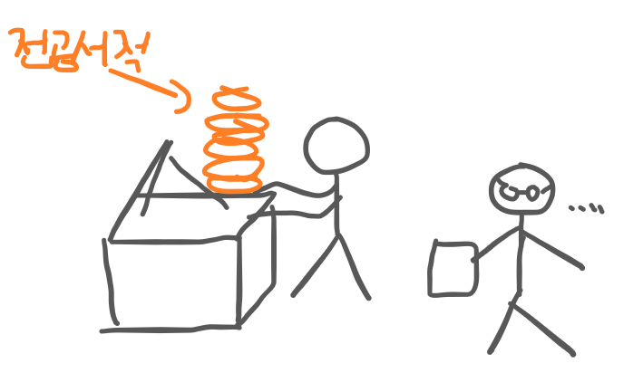

# 목표

CPU 스케줄링에 대해 이해한다.

# 예상 질문

- **CPU Scheduling?**
- **CPU 스케줄링은 언제 발생하는가?**
- **CPU 스케줄링의 종류를 설명하시오.**
- **선점 스케줄링과 비선점 스케줄링의 차이점?**

## **Scheduling**

CPU가 하나여도 프로그램들을 여러개 돌리겠죠 디코하고 노래듣고 겜하겠죠?

그 프로세스들이 동시에 실행되고 있는 것 처럼 보이지만, 실제로는 CPU가 작업 사이클을 굉장히 빠르게 작업 사이를 전환하고 있습니다.

한가지 예시를 들겠습니다.

복사기가 있어요. 면접 보기 위해 2장정도 서류 복사하러가는 곽민규와 cs공부하러 10권 제본뜨러가는 김민섭도 있습니다.

선착순으로 FCFS(First Come First Serve)이 일반적으론 맞겠지만, 뒷사람한테 좀 미안하겠죠
민규형 이력서 두장인데 취준하는 민섭이는 cs 책 10권복사하고있으니 ㅇㅇ
그렇다고 무작정 양보할 순 없는게, 끝도없이 양보요청을 받을 수도 있어요

> **이런 제한된 상황에서 가장 퍼포먼스를 올릴 수 있는 방법을 알아가는게 cpu 스케줄링 알고리즘입니다.**

## 스케줄링 알고리즘

- 먼저 온 사람이 복사하는 **FCFS** (FIFO),
- 가장 짧은 작업을 먼저 처리하는 **SJF**(Shortest Job First),
- 각 사람에게 동일한 시간만큼 복사기회를 제공하는 **Round Robin**

이 세가지가 기본적인 스케줄링 알고리즘입니다.

다시 정리하면

> **CPU(복사기)를 사용하려고 하는 프로세스(사람들) 사이의 우선 순위(줄서기)를 관리하는 것을 CPU 스케줄링이라고 합니다. (자원을 어떤 프로세스에 얼마나 할당하는지 정책을 만드는 것.)**

### 선점형, 비선점형 스케줄링 알고리즘

- 스케줄링 방식은 선점형과 비선점형으로 나누어진다.

> **선점형 : 환자가 이가경**

- 응급실에서 치료받고있는데 **위독한 가경**씨가 온다면 의사가 **저를 기다리게 하고 가경씨부터 치료**하겠죠?
- 이것이 선점형 스케줄링입니다. CPU(의사)가 **한 프로세스를 실행 중이더라도, 더 높은 우선 순위의 프로세스(이가경)가 도착하면 현재 프로세스를 중단하고 새 프로세스를 실행**합니다.

아까 예시에서, 복사기가 민섭이의 복사를 중단하고 바쁜 민규의 복사로 전환할 때, 민섭이의 이미 복사한 페이지 수와 남은 페이지 수를 기억해야겠죠?

CPU도 마찬가지로, 프로세스를 전환할 때 **현재 상태를 저장**하고 **새로운 프로세스의 상태를 불러와야 합니다.**

이를 **컨텍스트 스위칭**이라고 합니다.

> **비선점형 : 환자가 이성섭**

- 위급한 상황의 가경씨가 와도 절대 양보안하는 이성섭. **자기 차례가 끝나기 전까진 다른 프로세스는 cpu점유가 안됨**

### 선점형 스케줄링 종류

- **라운드 로빈, RR(Round Robin)**

  

  - 프로세스마다 **같은 크기의 CPU 시간**(타임 슬라이스)을 **할당**합니다. (보통 10 ~ 100ms)
  - 프로세스가 할당된 시간 내에 처리 완료를 못하면, 준비 큐 리스트의 가장 뒤로 보내지고 CPU는 다음 대기 프로세스로 넘어갑니다.
  - **균등한 CPU 점유 시간을 보장**합니다.

- **우선순위 스케줄링**
  - **높은 우선순위를 가진 프로세스가 CPU를 먼저 사용**합니다.
  - Priority 스케줄링은 선점형, 비선점형 둘 다 존재합니다.
- **다단계 큐 (Multilevel Queue) 스케줄링**
  
  - 롯데월드 기구탈 때 매직패스줄이랑 일반줄이랑 나누어 기구 태우듯, 각 큐에 따른 절차와 속도로 처리합니다.
  - 예를 들면 사용자 프로세스 큐, 시스템 프로세스 큐로 나누어 처리하는 방식이 있습니다.
- **다단계 피드백 큐 (Multi Level Feedback Queue) 스케줄링**
  - MQ와 비슷하지만, **각 큐 간에 프로세스들이 이동**할 수 있는 특징이 있어요

### 비선점형 스케줄링 종류

- **선착순. FCFS(First Come Fist Served)**
  - FIFO와 사실상 동일한 개념이다.
- **우선순위 스케줄링**
  - 이성섭 : 그 당시에 내가 제일 위급해서 1순위였는데, 갑자기 가경씨가 와서 양보해달라고? ㄴㄴ 안해줄거임 나 끝나면 그때 1순위먹으셈
- **데드라인 스케줄링 (Deadline)**
  - 작업들이 명시된 기간이나 기한 내에 완료되도록 하는 알고리즘.
  - 일반적으로 그리디를 활용해 스케줄링한다. 백준 보석도둑처럼ㅇㅇ
- **최단 작업 우선 스케줄링. SJF(Shortest Job First)**
  - 실행시간이 가장 짧은 프로세스를 선택해서 다음 실행을 수행하는 알고리즘
  - 당연히, CPU 요구시간이 긴 작업과 짧은 작업간의 불평등이 심하여 긴 프로세스는 기아 현상(Starvation)이 발생할 수 밖에 없다.
  
  - 응급실에서 계속 양보한 민섭씨는 죽기 직전이다..

??? : 그런 민섭씨를 위한 방법이 있습니다.

시스템 부하가 많아서 낮은 등급에 있는 준비 큐의 프로세스가 무한정 기다리는 현상(현재의 민섭씨)을 해결하기 위해,

**오랫동안 기다린 프로세스의 우선순위를 높여주는 에이징(Aging) 기법을 사용하면 조금 더 개선된다.**

- **HRN (Highest Response Ratio Next)**
  - 프로세스의 응답률을 기준으로 CPU를 할당하는 알고리즘입니다.
    - Response Ratio = (대기시간 + 서비스시간) / 서비스시간
    - 당연히 오래기다릴수록 응답률이 높아지겠죠
  - SJF(Shortest Job First)에 기반한, 대기시간을 고려한 변형

### 스케줄링 방법의 장단점들

이제 당연하게 추론이 됩니다.

가경씨가 환자인 선점형의 경우, 컨텍스트 스위칭이 잦게 되어 오버헤드가 발생할 수 있는 문제점이 있습니다.

대신, 긴급한 작업에 빠르게 대응할 수 있겠고, 적절한 알고리즘으로 공정성과 대기시간 최소화, CPU 사용률을 극대화시킬 수 있겠죠

따라서 현대 컴퓨팅 환경에서 널리 사용됩니다.

반대로, 환자가 성섭씨일 경우, 공정성이 없습니다. 대기시간도 높습니다. 중요한 작업이 있더라도 빠르게 해결하지 못할 가능성이 있습니다. 우선순위가 낮은 민섭씨는 치료를 못받겠네요

장점으론, 복잡한 알고리즘이 필요없어서 구현하기 상대적으로 쉽습니다. 컨텍스트 스위칭 오버헤드도 적습니다. 그리고 예측하기 쉽겠네요.

https://latter2005.tistory.com/102

https://eun-jeong.tistory.com/17

[https://velog.io/@chappi/OS는-할껀데-핵심만-합니다.-5편-스케줄링2-비선점형-스케줄링-알고리즘FCFS-SJF-HRN#4-hrn-스케줄링](https://velog.io/@chappi/OS%EB%8A%94-%ED%95%A0%EA%BB%80%EB%8D%B0-%ED%95%B5%EC%8B%AC%EB%A7%8C-%ED%95%A9%EB%8B%88%EB%8B%A4.-5%ED%8E%B8-%EC%8A%A4%EC%BC%80%EC%A4%84%EB%A7%812-%EB%B9%84%EC%84%A0%EC%A0%90%ED%98%95-%EC%8A%A4%EC%BC%80%EC%A4%84%EB%A7%81-%EC%95%8C%EA%B3%A0%EB%A6%AC%EC%A6%98FCFS-SJF-HRN#4-hrn-%EC%8A%A4%EC%BC%80%EC%A4%84%EB%A7%81)

and ChatGPT

### **CPU 스케줄링은 언제 발생하는가?**

"CPU 스케줄링은 운영체제가 CPU를 어떤 프로세스에 할당할지 결정하는 과정입니다. 이는 주로 네 가지 상황에서 발생합니다:

1. **프로세스 종료:** 실행 중인 프로세스가 종료될 때.
2. **I/O 대기:** 프로세스가 I/O 요청으로 대기 상태가 될 때.
3. **대기 상태 프로세스의 준비 완료:** 대기 상태에 있던 프로세스가 준비 상태로 전환될 때.
4. **프로세스가 실행 상태에서 대기 상태로 전환:** 예를 들어, 인터럽트나 시그널에 의해 현재 프로세스의 실행이 중단될 때.

이러한 상황에서 운영체제의 스케줄러는 다음에 실행할 적절한 프로세스를 선택하여 CPU의 효율적인 사용을 도모합니다."

위 내용은, 시간이 없어서 정리하지 못했기에 이 부분은 일단 넘기겠습니다.
