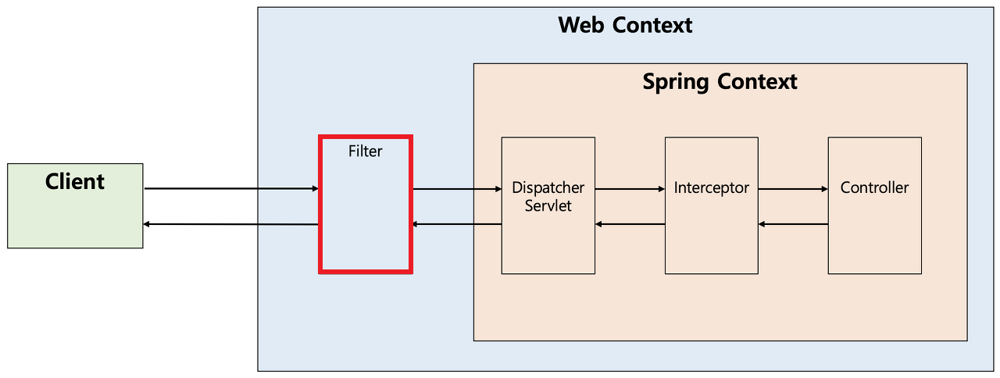
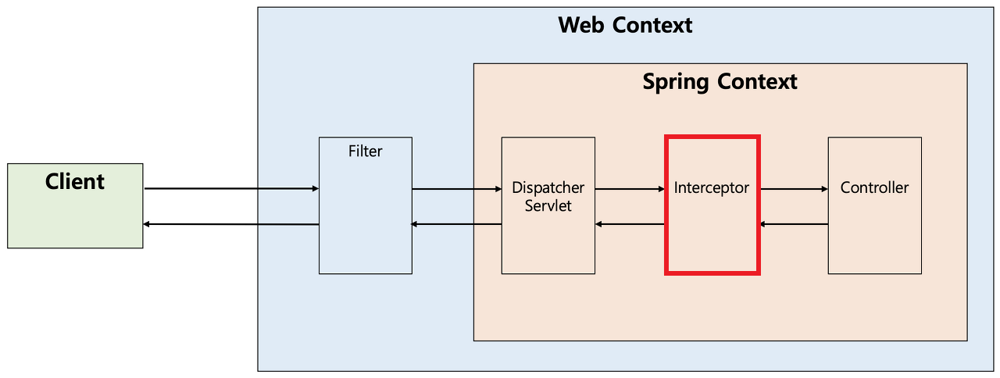

> :bulb: `Spring`에서는 공통으로 여러 작업을 처리함으로써, 중복된 코드를 제거할 수 있는 기능을 제공한다.
>
> 1. `Filter`
> 2. `Interceptor`
> 3. `AOP`

<br>

# 필터(Filter)



- [디스패처 서블릿](./servlet.md)에 요청이 전달되기 전/후 url 패턴에 맞는 모든 요청에 대해 부가작업 처리 기능 제공

- 디스패처 서블릿은 스프링 가장 앞단에 존재하는 프론트 컨트롤러이므로 <b>필터는 스프링 외부에서 처리</b>

<br>

## 사용 이유

## 메소드

- [`init()`](#init)
- [`doFilter()`](#dofilter)
- [`destroy()`](#destroy)

<br>

```
public interface Filter {

    public default void init(FilterConfig filterConfig) throws ServletException {}

    public void doFilter(ServletRequest request, ServletResponse response,
            FilterChain chain) throws IOException, ServletException;
    // 김민섭 왔다감
    public default void destroy() {}
}
```

<br>

### init()

- 필터 객체 <b>초기화 및 서비스에 추가</b>하기 위한 메소드
- 웹 컨테이너가 1회 init()을 호출하여 필터 객체를 초기화하면, 이후 요청들은 `doFilter()`를 통해 처리

### doFilter()

- <b>url 패턴</b>에 맞는 모든 HTTP 요청이 <b>디스패처 서블릿에 전달되기 전</b>에 웹 컨테이너에 의해 실행되는 메소드
- 파라미터인 `FilterChain`의 `doFilter()`를 통해 다음 대상으로 요청 전달
- chain.doFilter() 전/후에 필요한 처리 과정을 넣어 원하는 처리 진행

### destroy()

- 필터 객체를 서비스에서 제거하고, 사용하는 자원 반환을 위한 메소드
- 웹 컨테이너에 의해 1회 호출
- 필터 객체를 종료하면 이후에는 doFilter()에 의해 처리되지 않음

<br>

# 인터셉터(Interceptor)



- Spring이 제공하는 기술
- 디스패처 서블릿이 컨트롤러를 호출하기 전/후에 끼어들어 요청과 응답을 참조하거나 가공하는 기능 제공

## 사용 이유

- 특정 컨트롤러의 핸들러가 실행이 되기 전/후 추가적인 작업을 원할 때 사용
- 로그인 체크, 권한 체크 등

## 동작 순서

1. 사용자는 url을 통해 Request 객체를 보냄
2. 디스패처 서블릿은 해당 Request를 받아 분석한 뒤, 핸들러 매핑에게 사용자의 요청을 처리할 핸들러를 찾도록 요청
3. 핸들러 실행체인이 동작
4. 핸들러 실행체인으로 인해 하나이상의 핸들러 인터셉터를 거쳐 컨트롤러가 실행
   > 핸들러 인터셉터가 등록되어 있지 않다면, 곧바로 컨트롤러 실행

## 메소드

- [`preHandle()`](#prehandle)
- [`postHandle()`](#posthandle)
- [`afterCompletion()`](#aftercompletion)

<br>

```
public interface HandlerInterceptor {

    default boolean preHandle(HttpServletRequest request, HttpServletResponse response, Object handler)
        throws Exception {

        return true;
    }

    default void postHandle(HttpServletRequest request, HttpServletResponse response, Object handler,
        @Nullable ModelAndView modelAndView) throws Exception {
    }

    default void afterCompletion(HttpServletRequest request, HttpServletResponse response, Object handler,
        @Nullable Exception ex) throws Exception {
    }
}
```

<br>

### preHandle()

- 컨트롤러 호출 전에 실행
- 컨트롤러 이전에 처리해야 하는 전처리 작업 추가

### postHandle()

- 컨트롤러 호출 후에 실행 (View 렌더링 전)
- ModelAndView 타입을 반환하는데, 최근에는 RESTapi를 만들며 자주 사용되진 않음

### afterCompletion()

- 뷰 포함, 모든 작업이 완료 된 후에 실행 (View 렌더링 후)
- 요청 처리 중에 사용한 리소스 반환할 때 사용

<br>

# 필터 vs 인터셉터


## Request, Response 객체 조작 가능 여부

> 조작 : 내부 상태 변경이 아닌, 다른 객체로 바꿔친다는 뜻

- 필터는 조작 가능, 인터셉터는 조작 불가능

<br>

```
public class MyFilter implements Filter {

    @Override
    public void doFilter(ServletRequest request, ServletResponse response, FilterChain chain) throws IOException, ServletException {
        HttpServletResponse servletResponse = (HttpServletResponse) response;
        servletResponse.setStatus(HttpServletResponse.SC_NOT_FOUND);
        servletResponse.getWriter().print("Member Not Found");
    }
}
```

<br>

## 사용 사례

# :newspaper: Reference

- [필터 vs 인터셉터](https://mangkyu.tistory.com/173)
- [필터와 인터셉터의 차이](https://dev-coco.tistory.com/173)
