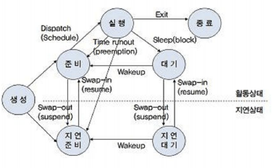
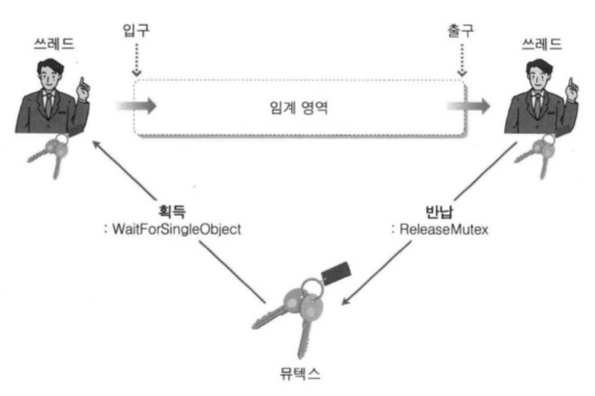
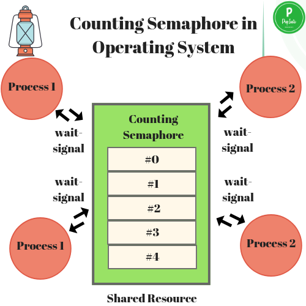

> :bulb: **프로세스 상태**
>
> 

# 공유 자원과 임계 영역

## 공유 자원 (Shared Resource)

- 시스템 안에서 프로세스, 스레드가 함께 접근할 수 있는 자원이나 변수
- ex) 모니터, 프린터, 메모리, 파일, 데이터 ...
- `경쟁 상태 (Race Condition)` : 공유 자원을 두개 이상의 프로세스가 동시에 읽거나 쓰는 상황

## 임계 영역 (Critical Section)

- 둘 이상의 프로세스, 스레드가 공유 자원에 접근할 때, 순서 등의 이유로 **결과가 달라지는 코드 영역**
- 해결하기 위한 방법은 뮤텍스, 세마포어, 모니터가 있음
  - 상호배제, 한정대기, 융통성 조건 만족
  - 메커니즘 : 잠금(Lock)

 

> :bulb: **임계구역 해결 조건**  
> `상호 배제`(mutual exclusion) : 한 프로세스가 임계 영역에 들어가면 다른 프로세스는 들어갈 수 없음  
> `한정 대기`(bounded waiting) : 특정 프로세스가 영원히 임계 영역에 들어가지 못하면 안됨  
> `융통성`(progress flexibility) : 한 프로세스가 다른 프로세스의 일을 방해해서는 안됨
>  

### 뮤텍스 (Mutex)

- 프로세스나 스레드가 공유 자원을 `lock()`을 통해 **잠금 설정**하고 사용한 후에는 `unlock()`을 통해 **잠금 해제**하는 객체
- 잠금 설정 시, 다른 프로세스나 스레드는 잠긴 코드영역에 접근 불가
- 잠금 / 잠금해제 라는 상태만 가짐

### 세마포어 (Semaphore)

- 일반화 된 뮤텍스
- 프로세스나 스레드가 공유 자원에 접근하면 wait() 수행, 해제하면 signal() 수행
- `wait(P)` : 자신의 차례가 올 때까지 기다리는 함수
- `signal(V)` : 다음 프로세스로 순서를 넘겨주는 함수
- `바이너리 세마포어`
  - 0, 1 만 가짐
  - 뮤텍스와 구현이 유사
    > :bulb: 뮤텍스 vs 바이너리 세마포어  
    > `뮤텍스` : 잠금 기반  
    > `바이너리 세마포어` : 신호 기반
- `카운팅 세마포어`
  - 여러개의 값을 갖는 세마포어 (최대 허용치 만큼 동시 사용자 접근 허용)
  - 여러 자원에 대한 접근 제어

### 모니터 (Monitor)

- 둘 이상의 스레드나 프로세스가 공유 자원에 안전하게 접근할 수 있도록 **공유 자원을 숨기고 접근에 대해 인터페이스만 제공**
- `모니터큐`를 이용해 공유 자원에 대한 작업들을 순차적으로 처리
- 세마포어보다 구현하기 쉬움
  - 모니터는 상호 배제 자동
  - 세마포어는 상호 배제 명시

# 교착 상태 (DeadLock)

- 두개 이상의 프로세스들이 서로가 가진 자원을 기다리며 중단된 상태
- A -> B -> A
- 프로세스의 흐름을 보면
  1. 자원 요청(request)
  2. 자원 받음(allocate)
  3. 자원 사용(use)
  4. 자원 해제(release)  
     => 모든 프로세스가 1번 상태에 있는 것이 `Deadlock`

## 원인 (발생 조건)

> 각각의 조건은 **독립적**

- `상호 배제` (Mutual Exclusion) : 한 프로세스가 자원 독점 -> 다른 프로세스 접근 불가능
- `점유 대기` (Hold and Wait) : 특정 프로세스가 점유한 자원을 다른 프로세스가 요청
- `비선점` (No Preemption) : 다른 프로세스의 자원을 강제로 가져올 수 없음
- `환형 대기` (Circular Wait) : 서로가 서로의 자원 요구 (위의 이미지와 같은 상태)

## 해결 방법

- `예방` (Prevention)
  - 교착상태가 발생할 수 있는 요구조건이 성립되지 않게 설계
  - 자원 낭비가 가장 심함
- `회피` (Avoidance)
  - 교착상태 발생 시 적절히 피해가기
  - `은행원 알고리즘` (Banker's Algorithm)
- `탐지 및 회복` (Detection And Recovery)
  - 교착상태가 발생할 경우 찾아내어 고침
  - `탐지` : 교착상태 발견 알고리즘, 자원할당 그래프
  - `회복` : 교착 상태 프로세스 **중지**(제거 될때까지 하나씩), **자원 선점**(교착 상태에 빠진 프로세스가 필요로 하는 자원을 강제 탈취 => 강종 후 재시작)

# 예상 질문

교착 상태가 발생한다면 어떻게 해결 할 수 있을까요?

 
가장 좋은 방식은 교착 상태가 발생할 수 없게 설계를 하는 것입니다. 
그러나 이 방식은 자원 낭비가 심하기 때문에 회피하거나 탐지 후 회복하는 방식을 채택해야 한다고 생각합니다. 

 

뮤텍스와 세마포어의 차이점을 설명해주세요.

 
두가지 방식 모두 잠금 기반으로 하여 임계 영역으로의 접근을 제어하는 방식입니다.  
차이점으로 뮤텍스는 1개의 열쇠이고, 세마포어는 여러개의 열쇠 개념입니다.  
뮤텍스는 락을 건 스레드만 해제할 수 있고, 세마포어는 시그널링   메커니즘으로 락을 걸지 않은 스레드도 시그널을 이용해 해제할 수 있습니다.  
세마포어의 카운트를 1로 설정하면 뮤텍스처럼 사용 가능합니다.

 

# Reference

[세마포어와 뮤텍스](https://incheol-jung.gitbook.io/docs/q-and-a/computer-science/undefined-1)
 
[스레드 동기화 기법](https://velog.io/@sjm1013ok/13%EC%9E%A5.-%EC%93%B0%EB%A0%88%EB%93%9C-%EB%8F%99%EA%B8%B0%ED%99%94-%EA%B8%B0%EB%B2%95-1-1)
 
[교착상태 개념과 발생 원인](https://velog.io/@zioo/Deadlock%EA%B5%90%EC%B0%A9-%EC%83%81%ED%83%9C%EC%9D%98-%EA%B0%9C%EB%85%90%EA%B3%BC-%EB%B0%9C%EC%83%9D-%EC%9B%90%EC%9D%B8)
 
[교착상태 해결 방법](https://velog.io/@ejung803/%EA%B5%90%EC%B0%A9%EC%83%81%ED%83%9C%EC%99%80-%EA%B5%90%EC%B0%A9%EC%83%81%ED%83%9C-%ED%95%B4%EA%B2%B0%EB%B0%A9%EB%B2%95)
