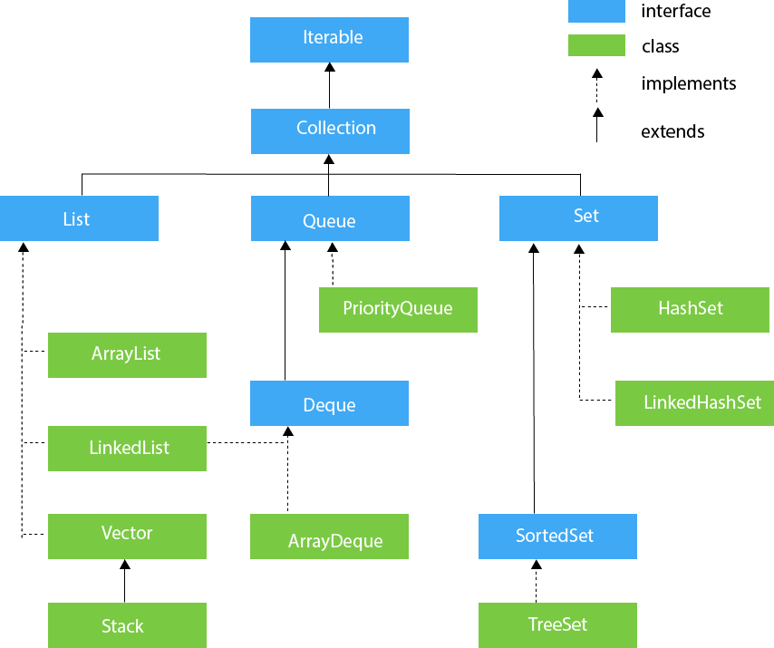

# List, Set, Map

list, Set과 Map은 컴퓨터 프로그래밍에서 널리 사용되는 자료구조입니다

## 목차

[📋 List](#📋-list)

[👨‍👩‍👧‍👦 map](#👨‍👩‍👧‍👦-map)

[🙄 set](#🙄-set)

[예상 질문](#⁉-예상-질문)

[Reference](#📋-reference)

---

  
<b>List, Set, Map 특징 정리</b>

  

| 인터페이스 | 구현체        | 순서                                 | 중복                                                                                  | 비고                                                        |
| ---------- | ------------- | ------------------------------------ | ------------------------------------------------------------------------------------- | ----------------------------------------------------------- |
| List       | ArrayList     | O | O                                                  |                                                             |
| set        | HashSet       | X     | X                                                      |                                                             |
|            | LinkedHashSet | O | X                                                      |                                                             |
|            | TreeSet       | X     | X                                                      | 입력된 데이터에 따라 정렬되어 저장( 입력순서 유지 X )       |
| Map        | HashMap       | O | Key: X  Value: O |                                                             |
|            | LinkedHashMap | O | Key: X  Value: O |                                                             |
|            | TreeMap       | X     | Key: X  Value: O | 입력된 Key(키)데이터에 따라 정렬되어 저장(입력순서 유지 X ) |

  

   

# 📋 List

## ❓ 리스트란?

자료를 순서대로 저장하는 자료구조

## ❗ 특징

- 입력 순서를 유지하며, 데이터의 중복을 허용
- 인덱스를 통해 저장 데이터에 접근 가능

## 🖇 리스트 유형(구조체)

### ArrayList

❓ 배열 기반의 리스트 구현체

<b>❗ 특징</b>

- 내부적으로 동적 배열을 사용해 요소 저장
  - 새 요소를 추가할 때 배열이 꽉 차면 크기를 자동으로 늘림
- 단방향 포인터 구조 데이터 순차적 접근(조회)가 빠름
  - 인덱스를 사용해 빠른 접근 가능 ( O(1) )
  - 삽입 및 삭제에의 경우 비효율적 ( O(n) )

### LinkedList

❓ 노드 기반의 리스트 구현체

<b>❗ 특징</b>

- 양방향 포인터 구조
  - 데이터의 삽입, 삭제가 빠름( O(1) )
  - Read, Update의 경우 ( O(n) )
  - 각 요소마다 포인터(메모리)가 필요

 

# 👨‍👩‍👧‍👦 Map

## ❓ 맵이란?

키와 데이터를 같이 저장할 수 있는 자료구조

## ❗ 특징
- 모든 데이터는 key, value가 존재
- value는 중복되어도 상관 없음
- 데이터 추가 순서는 중요하지 않음

## 🖇 맵 유형(구조체)

### HashMap

❓ 해시 테이블을 사용하여 키에 해당하는 데이터에 빠르게 접근할 수 있는 자료 구조

<b>❗ 특징</b>
- 키 입력에 대한 순서 보장 X
- key 중복 허용 X

### LinkedHashMap

❓ HashMap의 모든 기능을 가지면서, 삽입 순서 또는 접근 순서에 따라 요소를 순회할 수 있게 하는, 연결 리스트를 이용한 자료 구조

<b>❗ 특징</b>
- 키 입력에 대한 순서 보장 O
- key 중복 허용 X

### TreeMap
❓ 레드-블랙 트리를 기반으로 하여 키가 정렬된 상태로 데이터를 관리하는 자료 구조

<b>❗ 특징</b>
- 데이터 크기가 비교 가능한 경우, 오름차순으로 정렬
- key 중복 허용 X
- 입력 데이터가 사용자 정의 객체인 경우, Comparable을 구현하여 정렬 기준 설정 가능

  
<b>레드-블랙 트리란?</b>

  

  자가 균형 이진 검색 트리의 일종으로 각 노드가 레드또는 블랙으로 색칠되어 있는 특별한 구조의 트리

  

  
<b>자가균형 이진 검색 트리?</b>

  

    자식들이 한쪽으로 치우치는 것을 막기 위한 균형 기능이 추가된 트리
  

 
  <b>❗ 특징</b>
  - 루트 속성: 트리의 루트는 항상 블랙
  - 리프 속성: 모든 리프 노드는 블랙
  - 레드 노드 속성: 레드의 자식들은 모두 블랙
  - 블랙 높이 특성: 모든 노드에 대해 그 노드로부터 리프 노드까지의 모든 경로는 동일한 수의 블랙 노드를 포함
  

 

# 🙄 Set

## ❓ 셋이란?

데이터의 중복을 허용하지 않고, 키와 데이터를 저장하는 자료구조

## ❗ 특징
- 중복을 허용하지 않는 {"key" : "value"} 의 집합
- 입력 순서 유지 X, 데이터 중복 허용 X
  - null 입력이 가능하나, 한번만 저장하고 중복 저장 X 
- index가 따로 존재 X
  - iterator를 사용하여 조회

## 🖇 셋 유형(구조체)

### HashSet

❓ 데이터의 중복을 허용하지 않고, 해시 테이블을 사용하여 데이터를 빠르게 조회할 수 있는 집합 자료구조

<b>❗ 특징</b>
- 입력 순서 보장 X
- 데이터 중복 허용 X

### LinkedHashSet

❓ HashSet의 특성을 갖고 있으면서, 추가된 순서대로 요소를 순회할 수 있는 연결 리스트 기반의 집합 자료구조

<b>❗ 특징</b>
- 입력 순서 보장 O
- 데이터 중복 허용 X

### TreeSet

❓ 데이터의 중복을 허용하지 않으며, 레드-블랙 트리를 기반으로 데이터를 정렬된 순서로 저장하는 집합 자료구조

<b>❗ 특징</b>
- 데이터 중복 허용 X
- 데이터의 크기가 비교 가능한 경우 오름차순으로 정렬
- 입력 데이터가 사용자 정의 객체인 경우, Comparable을 구현하여 정렬 기준 설정 가능

  
<b> 각 언어의 set 사용</b>

  

  - 요소의 유일성이 중요할 때 사용
  - python의 set
  - java의 HashSet, TreeSet
  - C++의 std::set

### Python
해시 테이블 기반.
순서를 보장하지 않음.
중복된 요소를 허용하지 않음.
일반적인 연산(삽입, 삭제, 멤버십 테스트)의 시간 복잡도는 평균적으로 O(1)이지만, 최악의 경우 O(n)이 될 수 있음.

### Java
Set 인터페이스는 여러 구현체를 가짐.
HashSet: 해시 테이블을 사용, 요소의 순서를 유지하지 않음.
TreeSet: 레드-블랙 트리를 사용, 요소가 정렬된 상태로 유지됨.
LinkedHashSet: 해시 테이블과 연결 리스트를 사용, 삽입 순서를 유지함.

### C++
균형 이진 검색 트리(보통 레드-블랙 트리)를 사용.
요소는 자동으로 정렬됨.
삽입, 삭제, 검색 등의 연산은 O(log n)의 시간 복잡도를 가짐.

  

 

# ⁉ 예상 질문

  
<b>리스트, 맵, 셋의 차이를 설명하시오.</b>

  

  리스트는 자료를 순서대로 저장하는 자료구조이며,
   
  맵은 키와 데이터를 같이 저장할 수 있는 자료구조이며,
   
  셋은 중복을 허용하지 않고, 키와 데이터를 저장하는 자료구조입니다.
  

 

  
<b>set의 구조체들을 애기해보세요</b>

  

  set은 데이터의 중복을 허용하지 않고 key,value의 형태로 저장되는 자료구조입니다.
   
  set을 활용한 구조체는
   
  hashset, linkedhashset, treeset이 있습니다. 각각의 특징은
   
  hasheset은 hashtable을 기반으로 구현된 set이며,
   
  linkedhashset은 hashset을 기반으로 구현된 연결 리스트 기반의 set이며,
   
  Treeset은 자가 균형 이진 트리의 일종인 red-black트리를 기반으로 한 set이 있습니다.

  

 

# 📋 Reference

[자료구조1](https://www.crocus.co.kr/1553)

[자료구조2](https://hahahoho5915.tistory.com/35)

