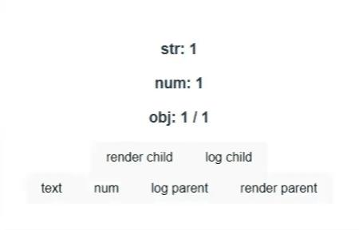

# React Render

## 1) 렌더링이란?

코드로 정의된 내용이 실제 브라우저 화면에 그려지는 과정

→ props와 state를 기반으로 UI를 구성한다

## 2) state, props

### State

- react에서 상태 변화는 새로운 것을 변경하는 것이 아니라, 새로운 instance를 생성해 교체한다.
- 따라서, state가 교체되는 경우, 무조건 렌더링이 된다,

### Props

- props의 state가 교체될 때 props를 받은 컴포넌트가 렌더링되기는 한다.
- props의 parent가 렌더링 될 때, child에서도 비로소 넘겨주기 때문에, 교체되는 것!

```javascript
<PropsTestChildComponent testNum={testNum} testText={testText} obj={obj} />
```

```javascript
return (
  <div id={renderer.toString()}>
    <h3>str: {testText}</h3>
    <h3>num: {testNum}</h3>
    <h3>
      obj: {obj.testNum} / {obj.testText}
    </h3>
    <button onClick={() => setRenderer((current) => !current)}>
      render child
    </button>
    <button onClick={() => console.log(testText, testNum, obj)}>
      log child
    </button>
  </div>
);
```


- child component는 렌더링되지 않음
- props의 교체를 관찰하고 있었다면, 렌더링이루어져야 함



- props는 부모 컴포넌트가 렌더링될 때 가져오기 때문에, 부모의 렌더링 없이 가져오는 것은 불가능함

## 렌더링 과정

**경로: 루트 → 하위 컴포넌트**

1. 함수 컴포넌트호출

컴포넌트 내 props, state,hook은 리액트의 fiber객체에 의해 관리되고

```
Fiber: 렌더링을 증분하는 것. 이는 렌더링 작업을 여러 덩어리로 나누어 여러 프레임에 분산하는 기능
```

2. 렌더 및 커밋 단계

렌더 단계에서는 새로운 가상 DOM을 생성한다, 그리고 커밋 단계에서 이를 실제 DOM에 반영한다

3. Passive Effects

커밋 이후 useLayoutEffect가 실행된다, 이는 useEffect와 달리 브라우저 화면에 가시적인 변화가 생기기 전에 동기적으로 실행됨(요청과 동시에 응답이 주어지는 것)

그리고 짧은 timeout 세팅 이후, 화면이 그려지고 useEffect가 실행됨

→ setState등의 원인으로 또 다시 렌더링 시작될 수 있음

4. 결과

렌더링 결과물이 DOM에 반영되고 화면이 그려진다. 물론 렌더링이 끝난 이후에도 가시적인 변화가 없을 수도 있음
